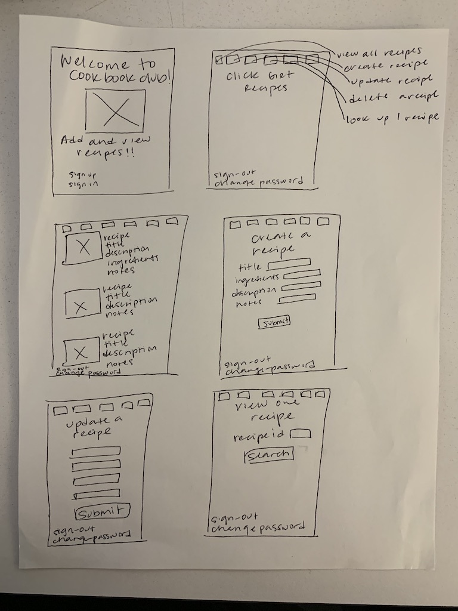

<h1>Cookbook Club</h1>
<h4>This application allows users to browse recipes in a Cookbook Club database.</h4>

<h4>Important Links</h4>

<h4>Technologies Used</h4>
<ul>
<li>HTML</li>
<li>CSS</li>
<li>JavaScript</li>
<li>jQuery</li>
<li>DOM</li>
<li>Handlebars</li>
<li>Bootstrap</li>
<li>AJAX</li>
<li>GitHub</li>
</ul>

<h4>Document Planning</h4>
  

  I began project two by creating more detailed user stories, wireframes, and ERDs than I did for my previous project. This use of time for planning was very helpful while working through various aspects of my project.

  I then moved onto building the backend of my project by using Ruby on Rails to set up a recipes table with a relationship to the user. I tested my resource's end points with curl scripts and added user ownership to the recipe controller.

  Once my backend was set up and running, I moved onto my client facing application. I proceeded to test (with curlscripts) and set up all authentication functionality so that a user can sign-up, sign-in, change-password, and sign-out.

  Finally, I created curlscipts to text CRUD actions on recipes. Once the curlscripts were successful, I added web page functionality for a user to be able to create, update, view (one and all recipes), and delete a recipe.
  

<h4>User Stories</h4>
<ul>
<li>As a new user, I want to sign up with an email, a password, a password confirmation so that I can create an account, become a user, and see confirmation on the screen.</li>
<li>As an existing user, I want to sign in with my email and password and see confirmation on the screen.</li>
<li>As a user, I want to change my password from my old to my new and see confirmation on the screen.</li>
<li>As a user, I want to sign out of my account and see confirmation that I've signed out.</li>
<li>As a user, I want to create a recipe with title, ingredients, description, and notes so that I can save it and access it in the future. I want to see status confirmation that recipe was created.</li>
<li>As a user, I want to update a recipe, so that I can modify any attribute in the recipe. I want to see status confirmation that the recipe was updated.</li>
<li>As a user, I want to delete a recipe by id and see confirmation of status on the screen.</li>
<li>As a user, I want to be able to look up a single recipe by id and see only that recipe.</li>
<li>As a user, I want to be able to see a list of all my recipes.</li>
</ul>

<h4>Wireframes</h4>

<h4>Unsolved Problems</h4>

I would eventually like to add an ingredient table to my project so that a user can look up recipes by keyword: ingredient. I would also like to apply bootstrap styling effects to my project, in particular experiment with using modals. Lastly, I want to sort all recipes by id number once a user updates and views all recipes.

